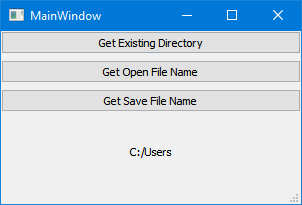

# FileDialog

`run.py` displays some modal dialogs to display some informational message.

run.py runs the MainWindow of the application and enables a user to traverse the file system in order to select one or many files or a directory. It returns a string with the directory and the file name.

https://doc.qt.io/qtforpython/PySide2/QtWidgets/QFileDialog.html

