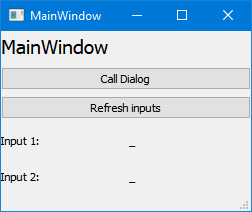
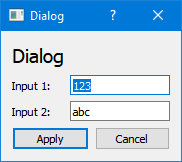
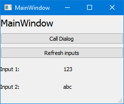

# MainWindow calls Dialog

`run.py` runs the `MainWindow` of the application that calls the `Dialog`. The `Dialod` asks for two inputs. The values of the inputs are displayed in the `MainWindow`.

