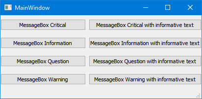
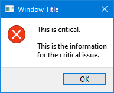
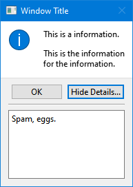

# MessageBox

`run.py` displays some modal dialogs to display some informational message.

https://doc.qt.io/qtforpython/PySide2/QtWidgets/QMessageBox.html

https://www.tutorialspoint.com/pyqt/pyqt_qmessagebox.htm

